# Repository for NLU project course academic year 2021/2022

In this repository there will be contained everything used for the project:

- source code
- report
- datasets

## Task 

The task to perform both **Slot filling** and **Intent classification** tasks.

In the literature there are proofs that models trained jointly on both tasks perform better than individual task specific models. 

### Slot filling
The sequence labelling task is defined as:
- Given a sequence of tokens $w = {w_1, w_2, ..., w_n}$,
- defining a sequence of labels as $l = {l_1, l_2, ..., l_n}$
- compute the sequence $\hat{l}$ such as $\hat{l} = \underset{l}{\operatorname{argmax}} P(l|w)$ 

\
An example from ATIS dataset is the following: 

| Slot Filling | | | | | | | | | | | | | |
|----- |----- |----- |----- |----- |----- |----- |----- |----- |----- |----- |----- |----- |----- |
| Input sequence: |i |'d |like |to |see |all |the |economy |fares |from |baltimore |to | philadelphia|
| Output sequence: | O |O |O |O |O |O |O |B-economy |O |O |B-fromloc.city_name |O |B-toloc.city_name|


### Intent classification
The intent classification problem is defined as follows:
- Given a sequence of tokens $w = {w_1, w_2, ..., w_n}$,
- And a set of labels $L$ where $l \in L$
- estimate the label $\hat{l}$ such as $\hat{l} = \underset{l}{\operatorname{argmax}} P(l|w)$ 

An example from ATIS dataset is the following:

| Intent Classification | | | | | | | | | | | | | |
|----- |----- |----- |----- |----- |----- |----- |----- |----- |----- |----- |----- |----- |----- |
| Input sequence: |i |'d |like |to |see |all |the |economy |fares |from |baltimore |to | philadelphia|
| Output label: | airfare |


## Dataset
The datasets that are used in the evaluation are ATIS (Airline Travel Information Systems) and SNIPS

### ATIS

Airline Travel Information Systems (ATIS) dataset is made of entries as such

```json
[
    {
        "utterance": "i want to fly from boston at 838 am and arrive in denver at 1110 in the morning",
        "slots": "O O O O O B-fromloc.city_name O B-depart_time.time I-depart_time.time O O O B-toloc.city_name O B-arrive_time.time O O B-arrive_time.period_of_day",
        "intent": "flight"
    },
    ...
]
```

### SNIPS

SNIPS dataset is made of entries as such

```json
[
    {
        "utterance": "listen to westbam alumb allergic on google music",
        "slots": "O O B-artist O B-album O B-service I-service",
        "intent": "PlayMusic"
    },
    ...
 ]
```

## Models

### Baseline LSTM
The first model to be evaluated is the model from LAB 10 of the course. It consists in a simple LSTM architecture, with two linear fully connected layers, one for each task.

Results:


 | ATIS |      |Balanced ATIS|      | SNIPS |     |
 |-----|----- |------------ |----- |------ |-----|
 |Slot F1|Intent Accuracy| Slot F1|Intent Accuracy| Slot F1|Intent Accuracy|
 | 92.42 |93.73| 94.33|96.97| 80.45|96.10|


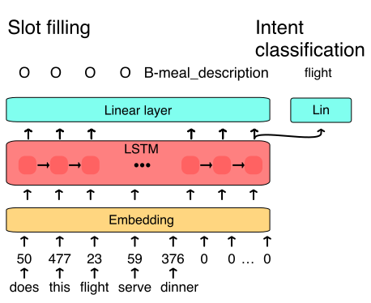
<!--  -->
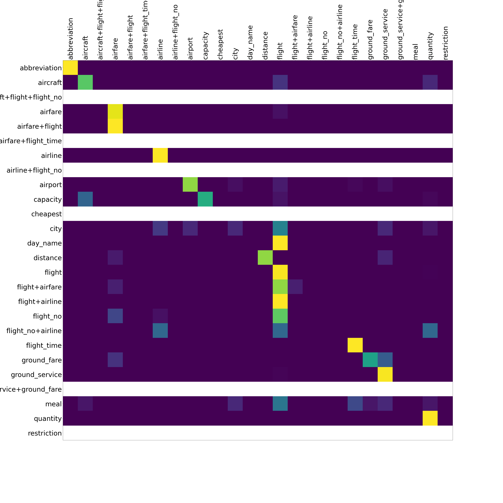
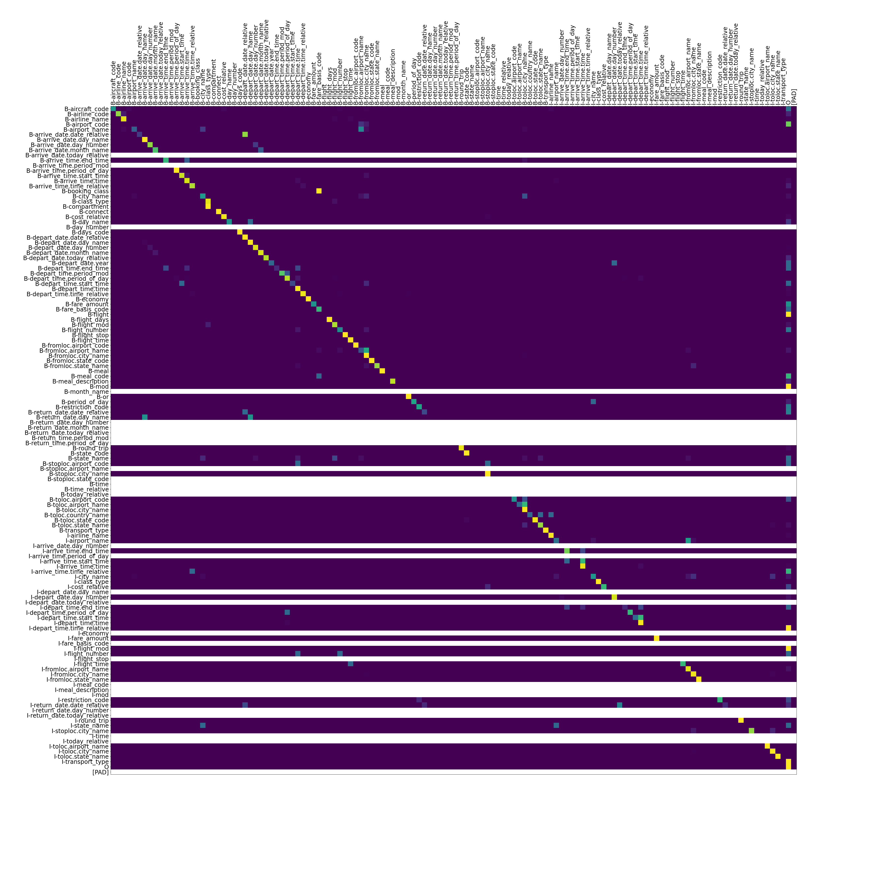
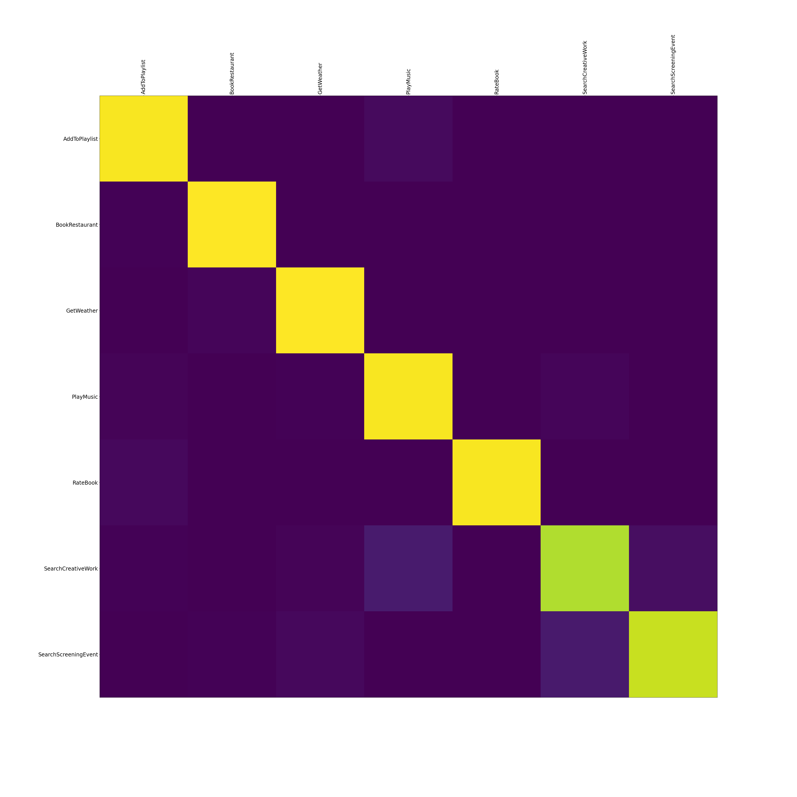
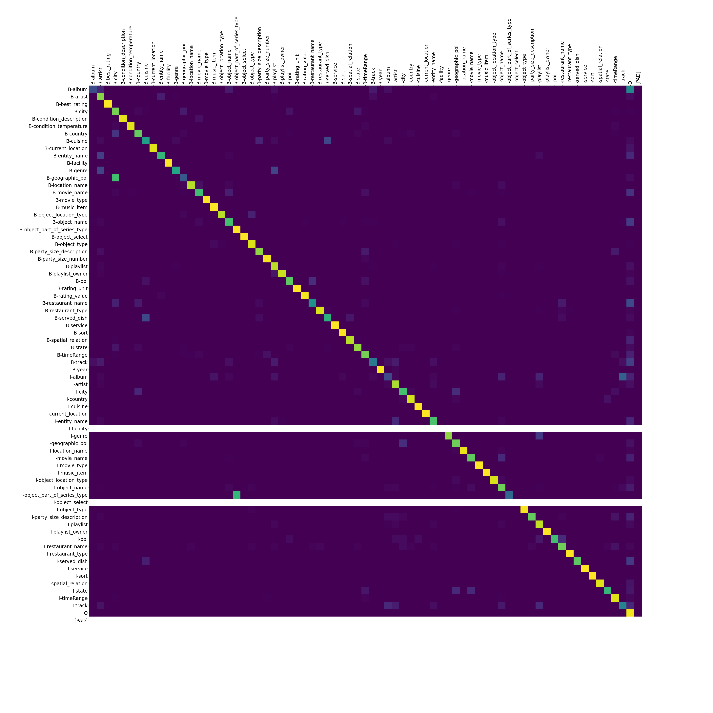


### BiLSTM
A slighlty improved LSTM over the baseline model:

- bidirectional LSTM
- increased size of embedding
- increased size of hidden
- increased number of layers for the LSTM
- layer normalization
- dropout
- better early stopping criteria, on both losses instead of slot filling f1 score
- increase number of epochs ( which is not a problem due to early stopping )

Plus:

- Randomly Weighted Loss
- Focal Loss

However it uses a pseudo randomly weighting, with the higher weight applied to the higher loss. This should help improve the results, as higher losses will be weighted more and therefore the model should learn better.

These improvements do not change drastically the architecture. Rather, they are small tweaks that allow to get a few points more. More precise tuning of the hyperparameters could further increase the score.

Results:


 | ATIS |      |Balanced ATIS|      | SNIPS |     |
 |-----|----- |------------ |----- |------ |-----|
 |Slot F1|Intent Accuracy| Slot F1|Intent Accuracy| Slot F1|Intent Accuracy|
 | 94.75 |95.30| 97.48|97.09| 88.02|96.80|


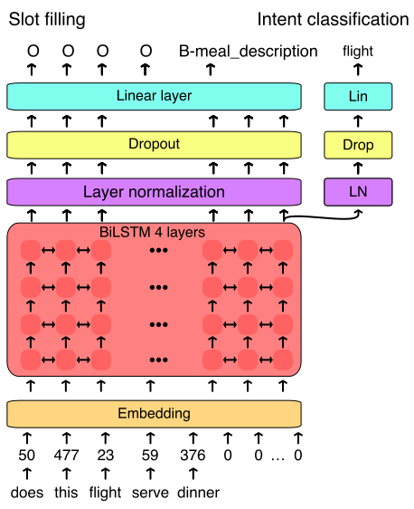


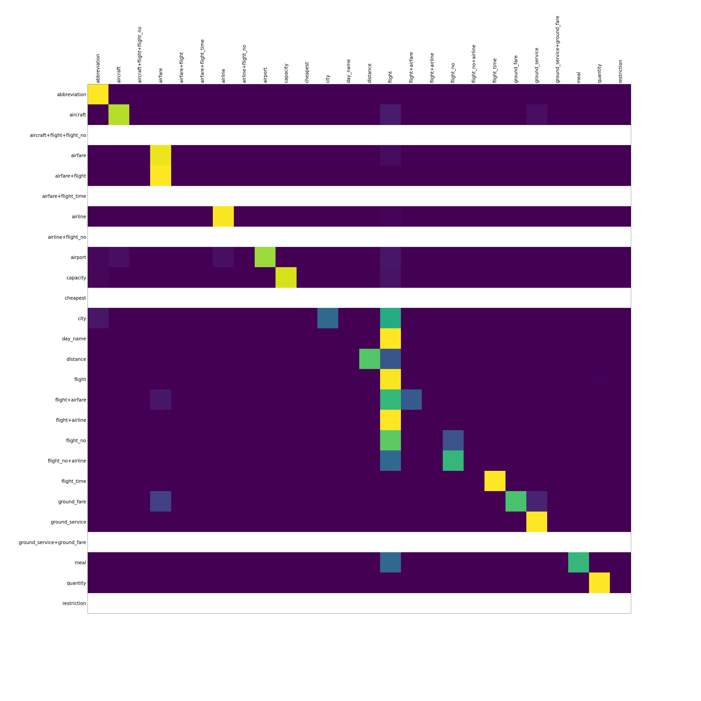
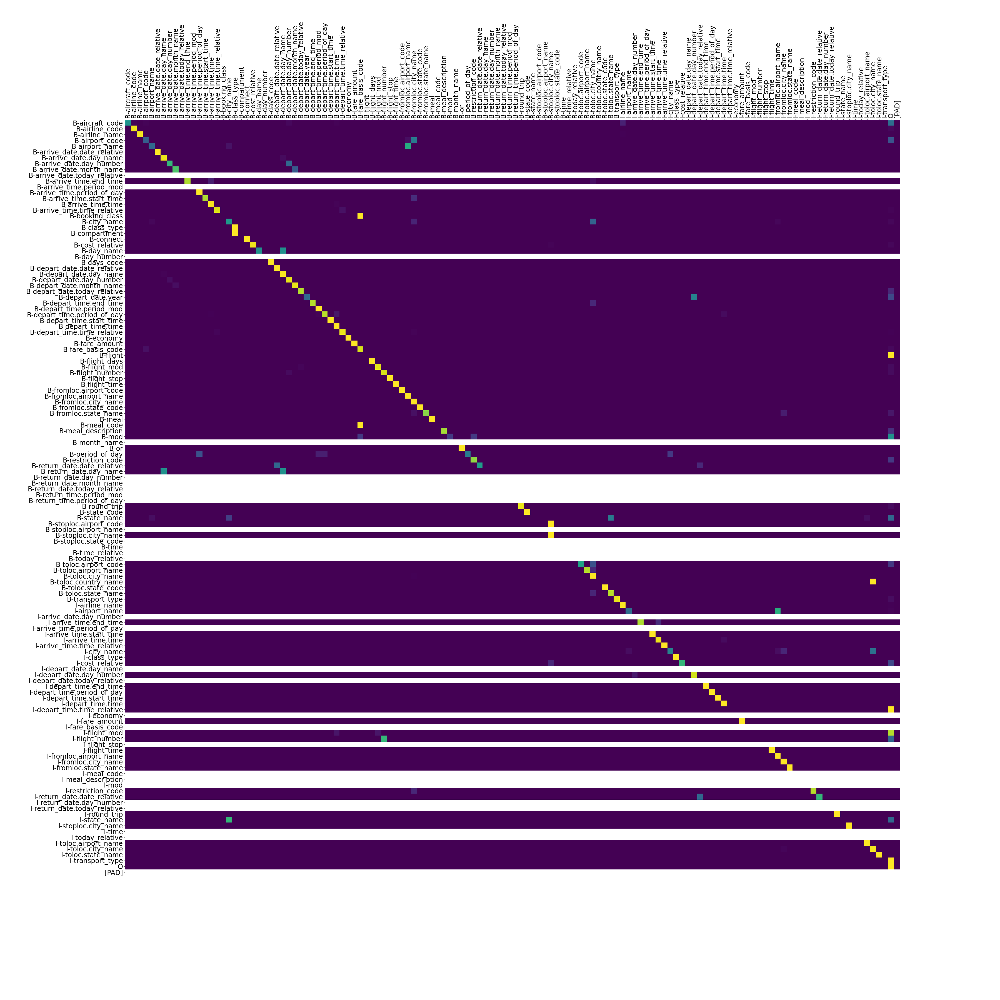
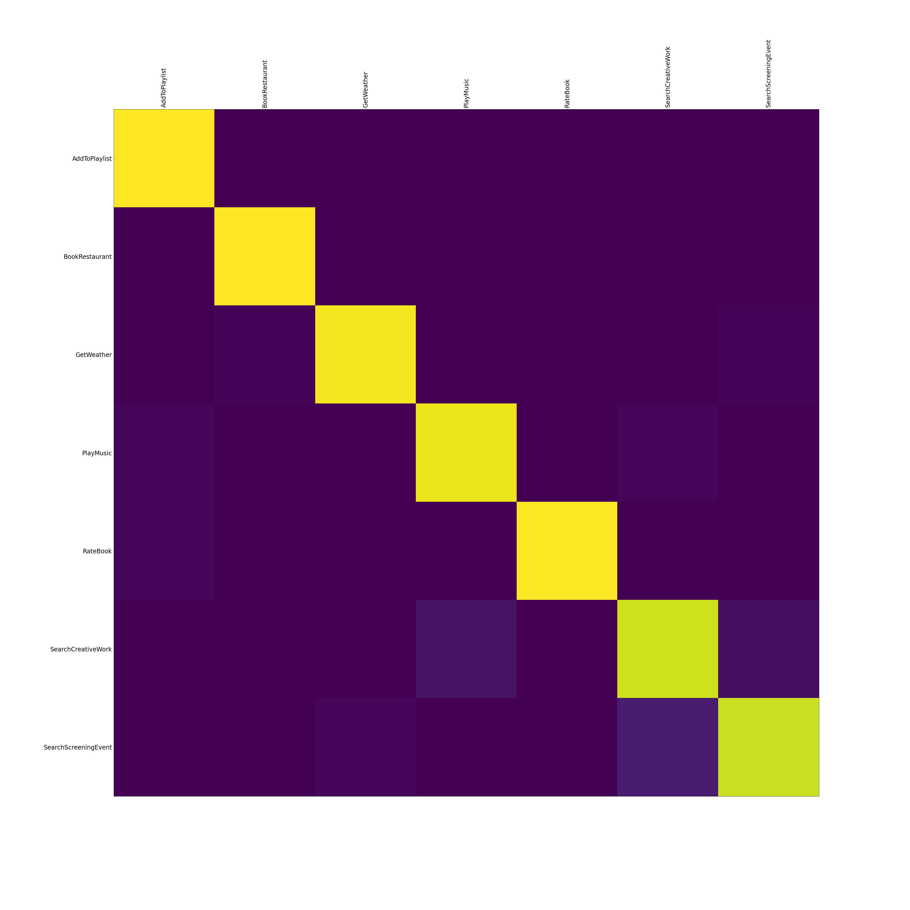
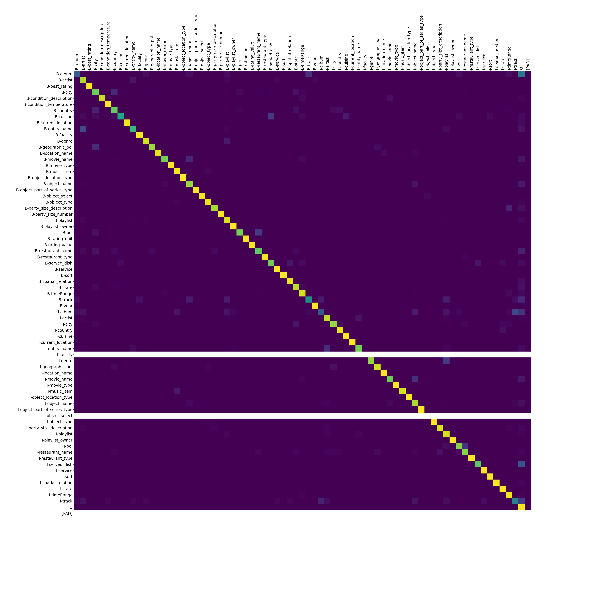


### BERT

Bidirectional Encoder Representations from Transformers (BERT) allow to encode sentences better than Recurrent models and at the same time being faster. 
I use a pre-trained BERT to extract embeddings and train a simple network to perfom the task

Results: 

 | ATIS |      |Balanced ATIS|      | SNIPS |     |
 |-----|----- |------------ |----- |------ |-----|
 |Slot F1|Intent Accuracy| Slot F1|Intent Accuracy| Slot F1|Intent Accuracy|
 | 86.67 |94.73| 89.84|96.86| 69.20|96.42|


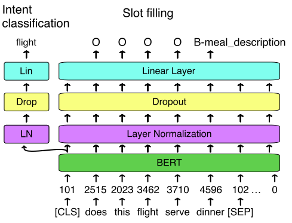
